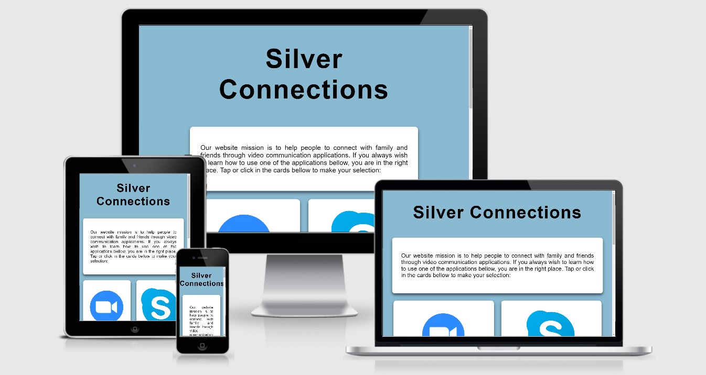

<h1 align="center">Silver Connections</h1>

[View the live project here.](https://hackathonbiteam10.github.io/silverconnections/index.html)

This is an instructional website aimed at elderly users that will outline how to use video communications technologies such as Zoom, Skype, Face time and messaging applications. It is designed to be fully responsive across a range of devices and incorporating simple design features to ensure visitors ease of use. 



## User Experience (UX)

-   ### User stories

    -   #### First Time Visitor Goals

        1. As a First Time Visitor, I want to easily understand how to use and navigate the site.
        2. As a First Time Visitor, I want the site to be designed simply, without ambiguous language and with clear and concise guiding prompts to find the content I am looking for.
        3. As a First Time Visitor, I want to understand the sites purpose.

    -   #### Returning Visitor Goals

        1. As a Returning Visitor, I want to refresh my understanding of how to use the technologies listed on the site.

    -   #### Frequent User Goals
        1. As a Frequent User, I want to be able to navigate with ease throughout the entire site.
        2. As a Frequent User, I want to learn about any new video communications technologies added to the site.
        3. As a Frequent User, I want to be able to request new "How To's" be added to the site for a new technology I have heard about.

-   ### Design
    -   #### Colour Scheme
        -   The 2 main colors used in this project were white and blue (#029ed9)
    -   #### Typography
        -   Arial was used across all pages on the site. A larger font size of between 1.5 and 1.8em was used with elderly users in mind.
    -   #### Imagery
        -   Images were an integral part to how the website is laid out and for it's help in guiding users to learn about the technologies listed. 

*   ### Wireframes

    -   Home Page Wireframe - [View](https://)

    -   Mobile Wireframe - [View](https://)

    -   Contact Us Page Wireframe - [View](https://)

## Features

-   The site is designed to be responsive across all device sizes and screens.

-   The site will include interactive features for users to interact with in order to find the information they are looking for.

## Technologies Used

### Languages Used

-   [HTML5](https://en.wikipedia.org/wiki/HTML5)
-   [CSS3](https://en.wikipedia.org/wiki/Cascading_Style_Sheets)

### Frameworks, Libraries & Programs Used

1. [Git](https://git-scm.com/)
    - This project uses Git for version control, the Gitpod terminal for commits to Git and to Push content to GitHub.
1. [GitHub:](https://github.com/)
    - This project uses GitHub to save code once it is pushed from Git.
1. [Balsamiq:](https://balsamiq.com/)
    - This project uses Balsamic Wireframes to show the inteded design outcome for this site. Click here to view the [wireframes](https://).
1. [AmIResponsive:](http://ami.responsivedesign.is/)
This project uses Am I Responsive for a layout of how the project will look across various devices.

## Testing

For testing the functionality of each page on the site, this project used the W3C Markup Validator for HTML and the W3C CSS Validator to ensure no syntax errors were present.

-   [W3C Markup Validator](https://validator.w3.org/) 
-   [W3C CSS Validator](https://jigsaw.w3.org/css-validator/#validate_by_input)

### Testing User Stories from User Experience (UX) Section

-   #### First Time Visitor Goals

    1. As a First Time Visitor, I want to easily understand how to use and navigate the site.

        1. On first viewing the site, users are introduced to the main image and header outlining how the site intends to help the user.
        2. The video communications tools listed are easily identified using interactive cards.
        3. The user intuitively understands that the content of the site continues down the page and all they have to do is to scroll to find the information that they are looking for.

    2.  As a First Time Visitor, I want the site to be designed simply, without ambiguous language and with clear and concise guiding prompts to find the content I am looking for.

        1. Each page on the site explains in precise, simplistic language what a user must do to navigate the site.
        2. On each card it is explained that a user must click to interact with the content in order to view the tutorial on how to use the specific technology. 
        3. Within each card there are simplistic step-by-step guides on how to download, sign up for and use the technologies included. There are also short embedded videos on how to use the selected video communications technology.

    3.  As a First Time Visitor, I want to understand the sites purpose.
        1. From the header on the top of the home page, a user will clearly understand what the sites purpose is from the short introduction of the sites purpose.
        2. Further information relating to the sites purpose will be evident from the description of the technologies listed using cards and a following explanation of each card containing a "How To" on using the technology.

-   #### Returning Visitor Goals

    1. As a Returning Visitor, I want to refresh my understanding of how to use the technologies listed on the site.

        1. The content is laid out in a simplistic manner that a returning user should have no problems refreshing their knowledge on how to use the site.

-   #### Frequent User Goals

    1. As a Frequent User, I want to be able to navigate with ease throughout the entire site.

        1. A frequent user will be comfortable in navigating the site. Therefore no major design changes should be implemented to the original layout of the page.

    2. As a Frequent User, I want to learn about any new video communications technologies added to the site.

        1. Any new additional technologies will be clearly outlined so a user who is not familiar with them will be able to learn more only a click away.

    3. As a Frequent User, I want to be able to request new "How To's" be added to the site for a new technology I have heard about.
        1. Perhaps a frequent user has heard of a new video communications technology and wants to learn more about it.
        2. However there are no "How To" guides availble that suit the users needs.
        3. The user should then be able to contact us and request we do a "How To" on the technology they are curious about.

### Further Testing

-   The website was tested across all major web browsers including Google Chrome, Brave, Safari, Microsoft Edge, Firefox and Intenet Explorer.
-   The website was tested across various devices such as Android and iPhone mobile phones, Tablets, Desktops and laptops to ensure it's responsiveness.
-   Detailed testing was conducted on all interactive links on the site to ensure their functionality.
-   Members of the Slack Community, family and friends were invited to test the website and to give their feedback on functionality and potential bugs.

### Known Bugs

-  Images are not showing up on other.html and will be fixed asap.

## Deployment

### GitHub Pages

This project was deployed to GitHub pages and can be viewd by following these steps:

1. Log in to GitHub and go to the [GitHub Repository](https://github.com/HackathonBITeam10/silverconnections)
2. Click on "Settings" just above the green button for "Code".
3. Scroll down the "Settings" page until you come to "GitHub Pages".
4. Under "Source" click on the dropdown which says "None" and select "Master Branch".
5. The page will refresh automatically and return you to the top of the page.
6. Go back doen to the "GitHub Pages" section and you will find the link to the now published site. [link:](https://hackathonbiteam10.github.io/silverconnections/index.html)

### Forking the GitHub Repository

Forking the GitHub Repository allows us to make a copy of the Original Repository. This allows a user to open the repositiory and to view and make changes without affecting the original. 
To do this, follow these steps:

1. Log in to GitHub and go to the [GitHub Repository](https://github.com/HackathonBITeam10/silverconnections)
2. Below the top right of the page under the Navbar, click on the "Fork" button.
3. A copy of the original repository has now been added to your GitHub account.

### Making a Local Clone

1. Log in to GitHub and go to the [GitHub Repository](https://github.com/HackathonBITeam10/silverconnections)
2. Click the green dropdown labelled "Code".
3. Copy the link under "Clone with HTTPS".
4. Open Git Bash.
5. Change the current working directory to the location where you want the cloned directory to be made.
6. Type `git clone`, and then paste the URL you copied in Step 3.

```
$ git clone https://github.com/YOUR-USERNAME/YOUR-REPOSITORY
```

7. Press Enter. Your local clone will be created.

```
$ git clone https://github.com/YOUR-USERNAME/YOUR-REPOSITORY
> Cloning into `CI-Clone`...
> remote: Counting objects: 10, done.
> remote: Compressing objects: 100% (8/8), done.
> remove: Total 10 (delta 1), reused 10 (delta 1)
> Unpacking objects: 100% (10/10), done.
```

Click [Here](https://help.github.com/en/github/creating-cloning-and-archiving-repositories/cloning-a-repository#cloning-a-repository-to-github-desktop) to retrieve pictures for some of the buttons and more detailed explanations of the above process.

## Credits

### Code

-   All code was written by the developers of BI Team 10 for the Code Institute July Hackathon 2020.

### Content

-   All content was written by the developers on this team.

-   Colors used in the project were considered for their emotional effectiveness as outlined in the following document [here](https://www.creativebloq.com/web-design/12-colours-and-emotions-they-evoke-61515112).

### Media

-   [Youtube](https://youtube.com/) - Instructional videos for Skype were taken from YouTube. 
-   [Google Images](https://images.google.com/) - Icons and instructional images were taken from Google Images with licence for re-use allowed.

### Acknowledgements

-   Many thanks to the Code Institute tutor support for guiding us through this project.

-   A huge thanks to everyone who added their feedback in the Slack Community channel as well as family and friends who tested the website and gave their inputs.